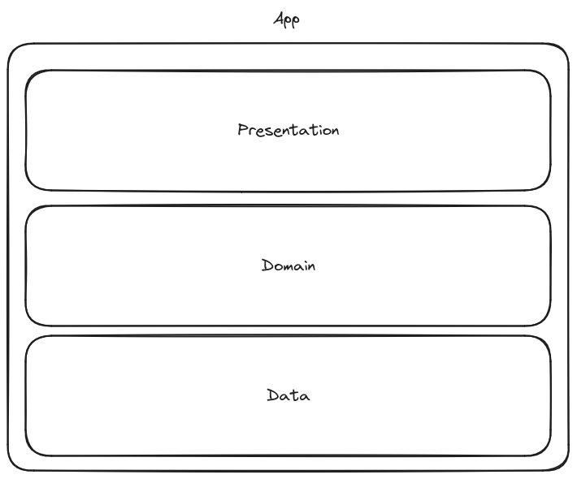
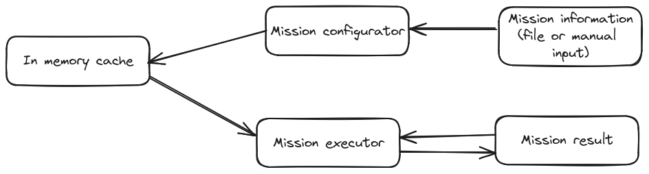

# Mars Rover - Code Challenge
The application allows you to configure a scanning area from a file that complies with the following format: 
```
{
  "topRightCorner": {
    "x": 5,
    "y": 5
  },
  "roverPosition": {
    "x": 1,
    "y": 2
  },
  "roverDirection": "N",
  "movements": "LMLMLMLMM"
}
```
Or on the other hand it allows the user to indicate the scanning area by entering the coordinates in the upper right corner.

## Prerequisites
- Android Studio Jellyfish (or later)
- Android SDK 21 
- Gradle 8.0+

## Architecture
For simplicity all the application is contained in a single module. At the same time this module can be differentiated into different packages, mainly to highlight.


- Data: This layer is solely focused on serving as an in-memory cache for the exploration configuration data.
- Domain: This layer contains all the logic for initializing the exploration and executing movements.
- Presentation: This layer handles the entire UI.

## Implementation details

### Model-View-ViewModel
MVVM allows us, making use of StateFlow, to have a kind of unidirectional architecture in the UI layer simplifying the management of the different states that can be rendered.
In addition, the ViewModel is responsible for updating and centralizing the state of the view. 
Except in a few occasions that I believe that the state can be contained in the component itself (For example, the state of + - in the TextInputFields).

### Error Handling
I have decided to use two different approaches for error handling.

First form:
In MissionConfigurator, various operations throw exceptions, which are then caught and transformed into domain-specific errors. I chose not to use Either or Result to encapsulate the outcomes since my primary goal is to understand the cause of the error and present it in a more user-friendly manner to the UI. This approach works well as no transformations are needed.

However, if extensive error handling or transformations were required, I would prefer to capture exceptions, convert them into domain-specific errors, and encapsulate them within an Either.

Second form:
In the case of MissionExecutor, it can only return a specific type of error. Since the error is known and no transformations are necessary, I opted to propagate the exception and handle it directly in the ViewModel to simplify the return logic for this use case.

A good improvement would be to unify error handling, as having different error management approaches in both screens could become confusing as the project scales.


### In memory cache

To quickly store the exploration data, I opted to create an in-memory cache. I generated the necessary abstractions to ensure that if the implementation of this memory needs to be changed in the future, it won't affect the data retrieval logic.



## Tech
- A couple of android libraries (appcompat, lifecycle...)
- Jetpack Compose
- Material 3
- [Kotlin seralization - In order to serialize the JSON](https://github.com/Kotlin/kotlinx.serialization)
- [Koin as DI](https://github.com/InsertKoinIO/koin)
- [Mockk - For mock dependecies in some test](https://github.com/mockk/mockk)
- [Roborazzi - For screenshot testing without depending on an emulator](https://github.com/takahirom/roborazzi)
- [Turbine - To facilitate Kotlin Flow testing](https://github.com/cashapp/turbine)


## Running Tests
To run unit and screenshot tests:
 ```sh
 ./gradlew testDebugUnitTest
 ```
### Files for testing
[Valid](./sample.json)

[Invalid](./invalid.json)

[Out of area](./out_area_sample_.json)

## Possible Improvements
- Modularize the project
- Instead of using an in-memory cache, use some kind of persistence solution (room, datastore...) to allow saving the mission configuration between uses. As well as the different movements...
- Add more screenshot test

## APK

[Release 1.0.0](https://github.com/gcaguilar/MarsRover/releases/tag/1.0.0)
